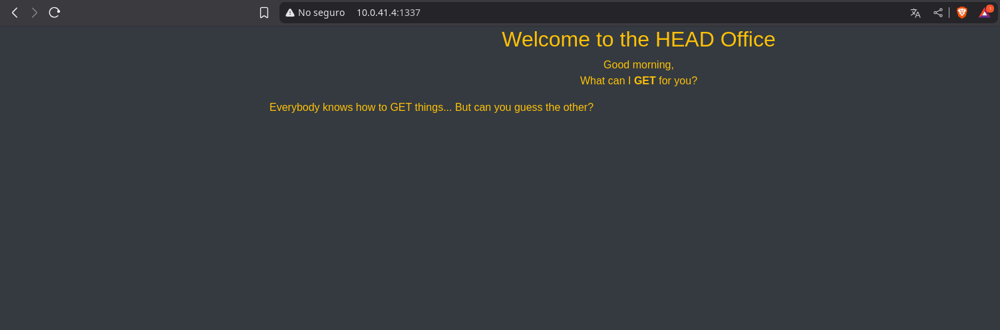

# HEADOFFICE

## INTRODUCTION

The machine **HEADOFFICE** from **echoCTF** provides the following hint:  
**"HEAD over to the HEAD Office and tell them to give you the flag..."**  
This machine hides a service and a flag within its website through the exploration of **HTTP headers**.

**IP:** `10.0.41.4`

---

## Reconnaissance and Scanning

We began reconnaissance on the HEADOFFICE machine using a full port scan with **Nmap**. The command used was:

```bash
kali@kali:~/echoctf$ nmap -sSC -vv -p- 10.0.41.4
```

**Result:**
```
PORT     STATE    SERVICE REASON
1337/tcp filtered waste   no-response
```

Port **1337** is filtered, indicating that the server did not respond to a common scan. When attempting an HTTP connection to IP `10.0.41.4` on port `1337`, we are shown the following webpage:



This page gives us a hint to explore the **HTTP HEADERS**. To view the headers of a web page, we can use the following command:

```bash
curl -I 10.0.41.4:1337
```

This command returns the following information, where we find our **flag**:

```
HTTP/1.1 200 OK
Server: nginx/1.18.0
Date: Mon, 21 Apr 2025 05:51:08 GMT
Content-Type: text/html; charset=UTF-8
Connection: keep-alive
X-Powered-By: PHP/7.4.23
1: ..____________
2: .< ETSCTF_it's_just_a_writeup_bro >
3: . ------------
4: .........\ ^__^
5: ..........\ (oO)\_______
6: .............(__)\ )\/\
7: .................||----w |
8: .................|| ||
```

---

## Mitigation Measures

Proper configuration of HTTP headers is essential, as sensitive information is disclosed, such as:
- The web server technology in use
- Lack of protections against **clickjacking**
- No explicit protections against **XSS** and other web-based attacks
