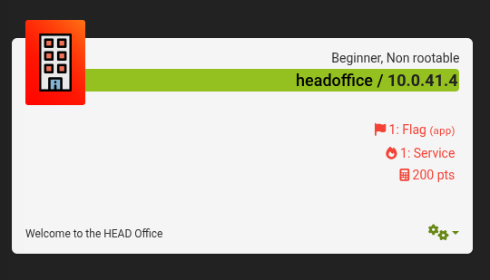

## INTRODUCCIÓN 

La maquina HEADOFFICE es una maquina de echoCTF que nos da la siguiente información como pista "HEAD over to the HEAD Office and tell them to give you the flag..." esta maquina oculta un servicio y una bandera en su pagina web A través de la exploración de cabeceras

IP: 10.0.41.4

---

### Reconocimiento y Escaneo

Comenzamos el reconocimiento de la maquina HEADOFFICE con un escaneo de puertos utilizando Nmap. el comando utilizado es el siguiente

``` bash
kali@kali:~/echoctf$ nmap -sSC -vv -p- 10.0.41.4
PORT STATE SERVICE REASON
1337/tcp filtered waste no-response
```


El puerto 1337 se encuentra filtrado, lo que indica que el servidor no estaba respondiendo a un escaneo común, al intentar una conexión HTTP a la ip "10.0.41.4" con el puerto 1337 nos da la siguiente pagina web


la cual nos da una pista sobre usar las [[HTTP HEADERS]], para visualizar las cabeceras de una pagina web lo podemos hacer con el siguiente comando

``` bash
curl -I 10.0.41.4:1337
```

Lo cual nos da la siguiente información, donde encontraremos nuestra bandera

``` bash

	HTTP/1.1 200 OK
	Server: nginx/1.18.0
	Date: Mon, 21 Apr 2025 05:51:08 GMT
	Content-Type: text/html; charset=UTF-8
	Connection: keep-alive Protección contra XSS y otros ataques
	X-Powered-By: PHP/7.4.23
	1: ..____________
	2: .< ETSCTF_it's_just_a_writeup_bro >
	3: . ------------
	4: .........\ ^__^
	5: ..........\ (oO)\_______
	6: .............(__)\ )\/\
	7: .................||----w |
	8: .................|| ||
```

### Medidas de mitigacion:

Correctas configuraciones ya que en laS [[HTTP HEADERS]] se encuentra información sensible como Tecnología del servidor web, Protección contra ataques de clickjacking y Protección contra XSS y otros ataques


