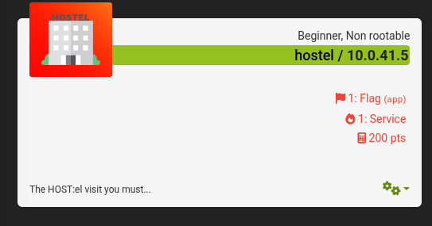

## **INTRODUCION**

La máquina **HOSTEL** de **EchoCTF** presenta un reto web donde se oculta un servicio y una bandera que pueden ser obtenidos mediante la modificación del [[HOST]] en una solicitud HTTP. La pista proporcionada por la máquina sugiere que la clave está en un [[HOST]] llamado `"el"`.

**IP:** `10.0.41.5`

---
## **Reconocimiento y Escaneo**

Comenzamos el reconocimiento de la máquina **HOSTEL** con un escaneo de puertos utilizando **Nmap**. El comando utilizado fue:
``` bash
nmap -sSC -v -p- 10.0.41.5
```
Resultado:
``` bash
PORT     STATE SERVICE
1337/tcp open  waste

```
El puerto **1337** se encuentra abierto. Al intentar una conexión HTTP a la IP `10.0.41.5` en dicho puerto, se nos presenta la siguiente pagina.


 Basándonos en la pista proporcionada por la máquina y la pagina, se intuye que la bandera está oculta detrás de un **[[HOST]] virtual** con el nombre `"el"`

## **Modificación de Host Header**

Para descubrir contenido servido bajo un [[HOST]] virtual, se puede modificar el **encabezado Host** de una solicitud HTTP. Esto se logra con el siguiente comando:
``` bash
curl -H "Host: el" http://10.0.41.5:1337
```
Respuesta del servidor:
``` bash 
Awesome work, here is your flag ETSCTF_not_yet_bro
```

La bandera se encuentra efectivamente al realizar la petición al host `"el"`, lo que confirma que el servidor utilizaba **virtual hosting** y entregaba contenido distinto en función del valor del encabezado [[HOST]].

## **Medidas de Mitigación**

El uso de **virtual hosts** es común, pero puede ser riesgoso si:

- Se deja accesible contenido sensible desde nombres de [[HOST]] que no están protegidos o documentados.
    
- No se configuran correctamente los encabezados HTTP ni se limita el acceso a los [[HOST]] virtuales por dirección IP o autenticación.
    

Para prevenir este tipo de exposición:

- Implementar un **reverso proxy** con control de [[HOST]] headers.
    
- Configurar reglas estrictas en el servidor web para ignorar peticiones con nombres de [[HOST]] no válidos.
    
- Monitorear el tráfico en busca de patrones sospechosos que usen [[HOST]] headers no comunes.


