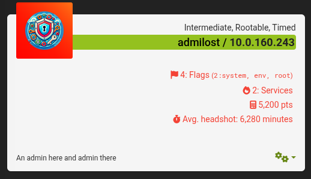

# Introduccion 
admin
admin123

``` python 
❯ rustscan -a 10.0.160.243
.----. .-. .-. .----..---.  .----. .---.   .--.  .-. .-.
| {}  }| { } |{ {__ {_   _}{ {__  /  ___} / {} \ |  `| |
| .-. \| {_} |.-._} } | |  .-._} }\     }/  /\  \| |\  |
`-' `-'`-----'`----'  `-'  `----'  `---' `-'  `-'`-' `-'
The Modern Day Port Scanner.
________________________________________
: http://discord.skerritt.blog         :
: https://github.com/RustScan/RustScan :
 --------------------------------------
To scan or not to scan? That is the question.

[~] The config file is expected to be at "/home/sheepsstealer/snap/rustscan/436/.rustscan.toml"
[!] File limit is lower than default batch size. Consider upping with --ulimit. May cause harm to sensitive servers
[!] Your file limit is very small, which negatively impacts RustScan's speed. Use the Docker image, or up the Ulimit with '--ulimit 5000'. 
Open 10.0.160.243:22
Open 10.0.160.243:80
[~] Starting Script(s)
[!] Error Exit code = 127
```

[Exploid and PoC](https://www.exploit-db.com/exploits/51590)

