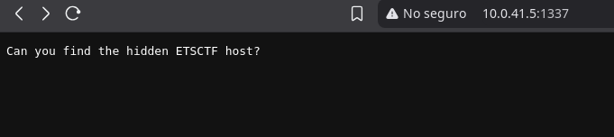

## **Introduction**

The **HOSTEL** machine from **EchoCTF** presents a web challenge where a hidden service and a flag can be retrieved by modifying the **Host Header** in an HTTP request. The hint provided by the machine suggests that the key lies in a host named `"el"`.

**IP:** `10.0.41.5`

---

## **Reconnaissance and Scanning**

We began reconnaissance on the **HOSTEL** machine using **Nmap**. The command used was:

```bash
nmap -sSC -v -p- 10.0.41.5
```

Result:
```bash
PORT     STATE SERVICE
1337/tcp open  waste
```

Port **1337** is open. When attempting an HTTP connection to IP `10.0.41.5` on that port, we are presented with the following page:



Based on the hint provided by the machine and the page, it is inferred that the flag is hidden behind a **virtual host** named `"el"`.

## **Host Header Modification**

To discover content served under a virtual host, the **Host** header of an HTTP request can be modified. This can be done using the following command:

```bash
curl -H "Host: el" http://10.0.41.5:1337
```

Server response:
```bash
Awesome work, here is your flag ETSCTF_not_yet_bro
```

The flag is effectively found by sending the request to the `"el"` host, confirming that the server was using **virtual hosting** and delivering different content based on the `Host` header value.

## **Mitigation Measures**

The use of **virtual hosts** is common, but it can be risky if:

- Sensitive content is accessible via hostnames that are undocumented or unprotected.

- HTTP headers are not properly configured or access to virtual hosts is not restricted by IP or authentication.

To prevent this type of exposure:

- Implement a **reverse proxy** with strict host header controls.

- Configure strict rules on the web server to ignore requests with invalid hostnames.

- Monitor traffic for suspicious patterns using uncommon host headers.
