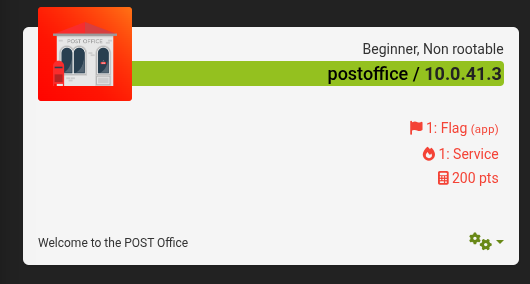

# POSTOFFICE - CTF WRITEUP


## Introducción

La máquina **POSTOFFICE** de **EchoCTF** presenta un reto enfocado en la manipulación del método HTTP **POST**. La pista nos indica que, aunque el método **GET** es comúnmente utilizado para obtener recursos, en este reto debemos explorar el método contrario para descubrir la bandera oculta.
___ 
## Reconocimiento y exploracion

Al acceder a la dirección:
``` cpp
http://10.0.41.3:1337/
```

Se muestra una página web sencilla con el mensaje:

> _"Everybody knows how to GET things... But can you guess the other?"_

Esto nos da una pista clara: el reto se resuelve haciendo uso del método HTTP **POST** para enviar datos y recibir la bandera.
Esto se puede hacer de dos formas, a continuacion explicare los dos

___
## Ejecucion de la solucion 

Se probó enviar una petición POST usando la herramienta **curl** en terminal:

```bash 
curl -X POST http://10.0.41.3:1337/ -d "data=test"
```

- `-X POST` indica que se usará el método HTTP POST. 
- `-d "data=test"` envía un cuerpo con datos `data=test`.

El servidor respondió con la bandera dentro de una página HTML:

```HTML
<p>Your packet has been posted. Here is your flag ETSCTF_Its_just_a_writeup_bro</p>
```
___
## Easter Egg

Si probamos  ver las cabeceras de la respuesta podemos encontrar la flag 

``` HTTP
 curl -I http://10.0.41.3:1337/
HTTP/1.1 200 OK
Server: nginx/1.18.0
Date: Wed, 28 May 2025 20:26:28 GMT
Content-Type: text/html; charset=UTF-8
Connection: keep-alive
X-Powered-By: PHP/7.4.23
1: ..____________
2: .< what what? >
3: . ------------
4: .........\   ^__^
5: ..........\  (oO)\_______
6: .............(__)\       )\/\
7: .................||----w |
8: .................||     ||
ETSCTF: ETSCTF_4928fe50c7d8d80eba74e908dd1594de
```
## Identificación de vulnerabilidades

- El servidor expone funcionalidad sensible solo mediante peticiones POST sin autenticación ni validación.
- No se limita ni controla el acceso al endpoint para diferentes métodos HTTP.
- Se asume que el cliente enviará datos válidos sin ninguna protección contra abusos o automatización.

---

## Medidas de mitigación recomendadas

- Implementar autenticación y autorización para endpoints que procesan datos sensibles.
- Validar y sanitizar entradas recibidas vía POST.
- Limitar métodos HTTP permitidos por endpoint según función.
- Monitorizar accesos y uso anómalo de endpoints con métodos POST.
