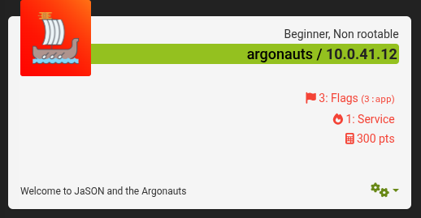
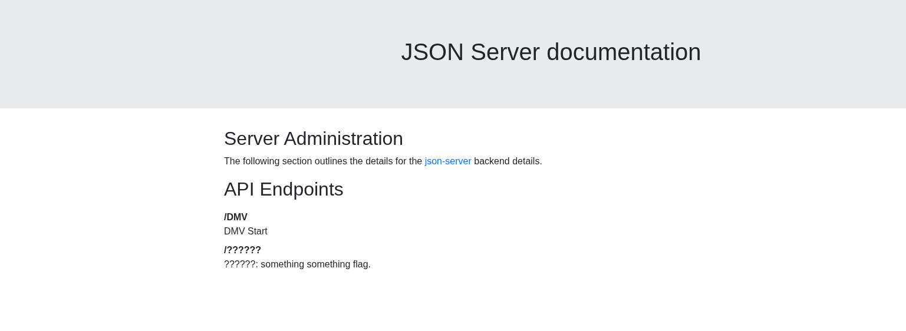

# Argonauts - CTF Writeup

**IP:** http://10.0.41.12:1337

---

## Introducción

La máquina **Argonauts** de **EchoCTF** presenta un reto basado en la exploración de una API JSON. El objetivo es descubrir banderas ocultas accediendo a distintos endpoints que revelan información sobre vehículos, propietarios y tipos de vehículos. La máquina funciona con un backend tipo JSON Server que expone datos mediante RESTful endpoints.

---

## Funcionamiento de json-server

**json-server** es una herramienta que crea rápidamente una API RESTful a partir de un archivo JSON, permitiendo realizar operaciones CRUD sobre recursos como `plates`, `owners` y `types`. Cada recurso tiene un endpoint estándar, y los datos se pueden obtener o modificar mediante llamadas HTTP.

---

## Reconocimiento y Exploración

Al acceder a `http://10.0.41.12:1337` se observa documentación indicando:




- Endpoint inicial: `/DMV`
- Endpoint oculto para la bandera: `/??????`
Se realiza una lectura rapida de [jason_server](https://github.com/typicode/json-server) para entender su funcionamiento y posteriormente hacemos la primera consulta, esta consulta se puede hacer tanto con `curl` como modificando la URL del sitio directamente en el navegador, por motivos practicos lo hare desde `curl` en este caso.

```bash
curl http://10.0.41.12:1337/DMV
```

Respuesta:

```json
[
  {
    "id": 1,
    "plate_id": 1,
    "owner_id": 2,
    "type_id": 1
  },
  {
    "id": 2,
    "plate_id": 4,
    "owner_id": 2,
    "type_id": 1
  }
]
```

---

## Exploración detallada

### `/plate/1`

```bash
curl http://10.0.41.12:1337/plate/1
```

Respuesta:

```json
{
  "id": 1,
  "number": "6535 XYZ",
  "type_id": 1
}
```

### `/plate`

```bash
curl http://10.0.41.12:1337/plate
```

Respuesta (fragmento):

```json
[
  {"id":1,"number":"6535 XYZ","type_id":1},
  {"id":2,"number":"3735 QWE","type_id":2},
  {"id":3,"number":"ETSCTF_JUNO_WAS_HERE_HEHEHE","type_id":2},
  {"id":4,"number":"4890 LKJ","type_id":1},
  {"id":5,"number":"2193 JGH","type_id":2}
]
```

---

### `/owner`

```bash
curl http://10.0.41.12:1337/owner
```

Respuesta:

```json
[
  {"id":2,"name":"Name Surname other"},
  {"id":3,"name":"ETSCTF_JUNO_WAS_HERE_HEHEHE"}
]
```

---

### `/type`

```bash
curl http://10.0.41.12:1337/type
```

Respuesta:

```json
[
  {"id":1,"name":"VAN"},
  {"id":3,"name":"CAR"}
]
```

---

## Última bandera encontrada

Consultando el endpoint oculto que se sugiere en la documentación:

```bash
curl http://10.0.41.12:1337/ETSCTF
```

Respuesta:

```json
{
  "value": "ETSCTF_JUNO_WAS_HERE_HEHEHE"
}
```

---

## Riesgos de Seguridad

- Exposición total de datos sensibles sin autenticación.
- Falta de control de acceso y validación.
- IDOR implícito por uso de IDs secuenciales.
- Endpoint oculto sin protección.

---

## Vulnerabilidades

- Ausencia de autenticación y autorización.
- Exposición de banderas a través de endpoints públicos.
- Falta de validación de permisos en la API.

---

## Medidas de mitigación

- Implementar autenticación y autorización en la API.
- Usar identificadores no predecibles (UUIDs).
- Restringir métodos HTTP en producción.
- Monitorizar accesos y actividades sospechosas.
- No exponer datos sensibles en entornos públicos.

---

## Conclusión para enseñanza

Este reto ejemplifica cómo un json-server sin medidas de seguridad puede exponer datos confidenciales fácilmente. Es fundamental aplicar controles de acceso, validar permisos y evitar exposiciones innecesarias en APIs RESTful.

---

**-Writeup by SheepsStealer-**
