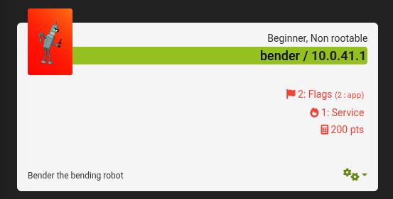
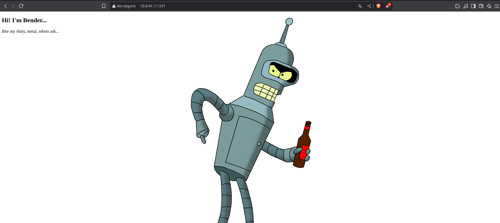
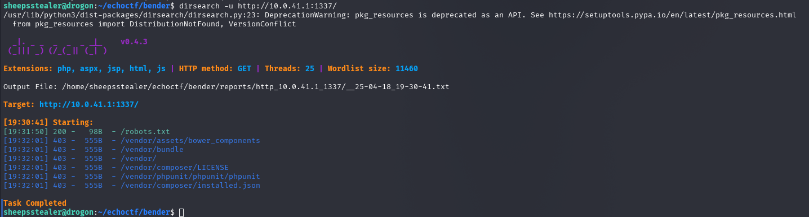
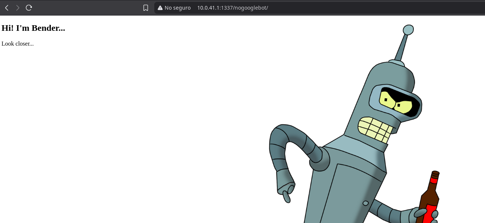

## Introduction

The Bender machine from EchoCTF hides two flags on its website. Through the exploration of the `robots.txt` file, we found the paths that lead us to the flags.  
**IP:** 10.0.41.1

## Reconnaissance and Scanning

We began the reconnaissance phase of the Bender machine by performing a port scan using Nmap. The command used was:

	sheepsstealer@drogon:~/echoctf/bender$ nmap -sCS -vv -p 1337 10.0.41.1

	PORT     STATE    SERVICE REASON  
	1337/tcp filtered waste   no-response

Port 1337 was found to be filtered, indicating that the server was not responding to a typical scan. When attempting an HTTP connection to IP `10.0.41.1` on port `1337`, we received the following web page:

# Fuzzing with dirsearch

After that, we performed fuzzing with `dirsearch` to identify additional paths and directories on the page. The output indicated that the `/nogooglebot/` directory was disallowed for search engines, suggesting that there might be hidden or sensitive content in that location.

We observed that the only directory with a 200 (OK) response code was `/robots.txt`. Upon reviewing its content, we found the following:

	 well done ETSCTF_ae1764e05e046f3770ac7b396c4ab0a2
	User-agent: Googlebot
	Disallow: /nogooglebot/

This gave us the first flag. Moreover, the file revealed that the `/nogooglebot/` directory was disallowed for search engines, again suggesting hidden or sensitive content.

## Access to /nogooglebot/

When accessing the `/nogooglebot/` directory, we found another section of the website displaying the message: `"Look Closer"`.

Inspecting the page's source code, specifically the section with the "Look Closer" message, we found the second flag:

	<!-- ETSCTF_e79422930da899e5634d7f9da9c601a2 -->

## Vulnerability Identification

The `robots.txt` file is not a security mechanism, but in this case, it disclosed critical information about a directory that should not have been indexed by search engines. While not a serious vulnerability on its own, it is considered poor practice to leave sensitive content accessible in this manner.

## Mitigation Measures

**Directory validation:** Ensure that sensitive directories are not publicly accessible, either through additional security configurations or using tools such as `.htaccess` on web servers.

-Writeup by JunoGG-